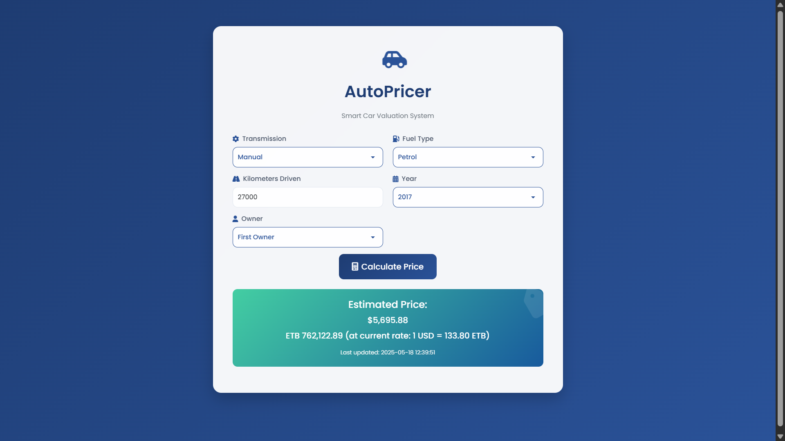

# AutoPricer - Smart Car Valuation System 🚗

AutoPricer is a modern web application that predicts used car prices using machine learning. Built with Python and Flask, it provides accurate price estimations in both USD and Ethiopian Birr (ETB) with real-time currency conversion.



## Features ✨

- **Smart Price Prediction**: Uses Random Forest algorithm trained on extensive car data
- **Dual Currency Support**: Shows prices in USD and ETB with real-time exchange rates
- **User-Friendly Interface**: Modern, responsive design with intuitive controls
- **Interactive Elements**: Animated components and smooth transitions
- **Organized Year Selection**: Grouped year ranges for easier navigation
- **Real-Time Updates**: Timestamp for each prediction with current exchange rates

## Technology Stack 🛠️

- **Backend**: Python, Flask
- **Frontend**: HTML5, CSS3, JavaScript
- **Machine Learning**: scikit-learn (Random Forest Regressor)
- **Data Processing**: pandas, numpy
- **Exchange Rates**: ExchangeRate-API integration

## Local Setup and Installation 🚀

1. Clone the repository:
```bash
git clone https://github.com/yourusername/Car-Price-Prediction-Model.git
cd Car-Price-Prediction-Model
```

2. Install required packages:
```bash
pip install -r requirements.txt
```

3. Set up your ExchangeRate-API key:
- Sign up at [ExchangeRate-API](https://www.exchangerate-api.com/)
- Replace `YOUR_API_KEY` in `app.py` with your actual API key

4. Run the application:
```bash
python app.py
```

5. Open your browser and navigate to:
```
http://localhost:5000
```

## Deployment Guide 🌐

### Deploying to Render

1. Create a Render account at [render.com](https://render.com)

2. Create a new Web Service:
   - Connect your GitHub repository
   - Select the Python runtime
   - Set the build command:
     ```bash
     pip install -r requirements.txt
     ```
   - Set the start command:
     ```bash
     gunicorn app:app
     ```

3. Add Environment Variables:
   - Add your ExchangeRate-API key:
     - Key: `EXCHANGE_RATE_API_KEY`
     - Value: Your API key from ExchangeRate-API

4. Deploy:
   - Click "Create Web Service"
   - Render will automatically build and deploy your application

Your application will be available at: `https://your-app-name.onrender.com`

### Alternative Deployment Options

- **Railway**: Similar setup to Render, with GitHub integration
- **Heroku**: More robust but paid option
- **AWS Elastic Beanstalk**: Good for scaling but more complex setup

## Usage Guide 📖

1. Select the car's transmission type (Manual/Automatic)
2. Choose the fuel type (Petrol/Diesel/Other)
3. Enter the kilometers driven
4. Select the manufacturing year from the grouped dropdown
5. Choose the owner type
6. Click "Calculate Price" to get the prediction

The result will show:
- Estimated price in USD
- Equivalent amount in ETB (using current exchange rate)
- Timestamp of the prediction

## Model Information 🤖

The prediction model:
- Uses Random Forest Regression
- Trained on car-dataset.csv
- Features include:
  - Transmission type
  - Fuel type
  - Kilometers driven
  - Manufacturing year
  - Owner history

## Contributing 🤝

Contributions are welcome! Please feel free to submit a Pull Request.

## License 📄

This project is licensed under the MIT License - see the LICENSE file for details.

## Acknowledgments 👏

- Dataset source: car-dataset.csv
- Exchange rates provided by ExchangeRate-API
- UI components inspired by modern design practices

## Support 💬

For support, please open an issue in the GitHub repository or contact the maintainers.

---
Made with ❤️ in Ethiopia
